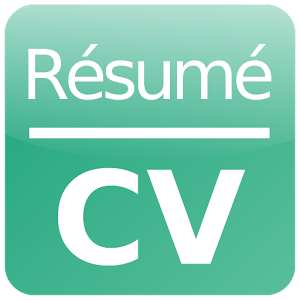

# CV, Resume, Portfolio, Skills, Career, Bio, All-In-One Web Site #

[](https://github.com/conventional-changelog/standard-version)
[](https://david-dm.org/tbaltrushaitis/cv)
[](https://github.com/tbaltrushaitis/cv/blob/master/LICENSE)
[](https://github.com/tbaltrushaitis/cv/graphs/contributors)



`cv` `resume` `portfolio` `skillset` `professional` `specialist` `IT` `curriculum` `vitae` `site`

---

## :computer: Live Demo ##
See it in action on my [Portfolio Site](http://bit.ly/tomascv) :point_left:

---

## What Is a Curriculum Vitae? ##

**Curriculum vitae** (CV) provides a summary of one’s experience and skills.

CVs include information on one’s academic background, including teaching experience, degrees, research, awards, publications, presentations, and other achievements. CVs are thus much longer than resumes, and include more information, particularly related to academic background.

A curriculum vitae summary is a one-to-two-page, condensed version of a full curriculum vitae. A CV summary is a way to quickly and concisely convey one’s skills and qualifications. Sometimes large organizations will ask for a one-page CV summary when they expect a large pool of applicants.

[Source](https://www.thebalance.com/cv-vs-resume-2058495)

---

## :runner: Usage ##

### 1. :briefcase: Download ###
```shell
$ APP_NAME=cv \
&& git clone https://github.com/tbaltrushaitis/${APP_NAME}.git \
&& cd ${APP_NAME}
```

---

### 2. :wrench: Setup ###
```shell
$ make
```

---

### 3. :pencil2: Fill ###

Input your data into proper sections of `index.html`

---

### 4. :koala: Enjoy ###

Post a link to your CV on a sites you need a profile page that provide a lots about your professional skills and experience

---

## :octocat: Credits ##

 Name | Version | Description |
:-----|:-------:|:------------|
 [animate.css](http://daneden.github.io/animate.css/) | 3.5.2 | A cross-browser library of CSS animations
 [normalize.css](http://necolas.github.io/normalize.css/) | 7.0.0 | A modern alternative to CSS resets
 [FontAwesome](http://fontawesome.io/) | 4.7.0 | The iconic Font and CSS toolkit
 [Bootstrap](http://getbootstrap.com) | 3.3.7 | Front-end framework for developing responsive, mobile first projects on the web
 [jQuery](http://jquery.com/) | 3.3.1 | JavaScript Library
 [noty](http://ned.im/noty) | 2.4.1 | Notification library
 [waypoints](https://github.com/imakewebthings/waypoints) | 4.0.1 | Easily execute a function when you scroll to an element
 [wow.js](https://wowjs.uk/) | 1.3.0 | Reveal CSS animation as you scroll down a page
 [iamx](https://trendytheme.net/items/i-am-x-html-resume-template/) | 1.2.0 | Trendy Theme

---

## :pushpin: Todo List ##

- [ ] - upgrade to noty v3

---

## :memo: Changelog ##

**v0.1.2:**
- [x] Updated jQuery to v3.3.1 due to critical vulnerability
- [x] Updated versions of few packages

**v0.1.1:**
- [x] Makefile included
- [x] gulp tasks to build and update webroot
- [x] small improvement of contacts section

**v0.1.0:**
- [x] More animations
- [x] Improved frontend javascripts
- [x] Dependencies update

**v0.0.0:**
- [x] Initial release

---

### :link: More Info ###

 - [Markdown Howto](https://bitbucket.org/tutorials/markdowndemo)
 - [Linking containers](https://docs.docker.com/engine/userguide/networking/default_network/dockerlinks.md)
 - [Cross-host linking containers](https://docs.docker.com/engine/admin/ambassador_pattern_linking.md)
 - [Creating an Automated Build](https://docs.docker.com/docker-hub/builds/)

---
> Developed in **May 2016**

:scorpius:
