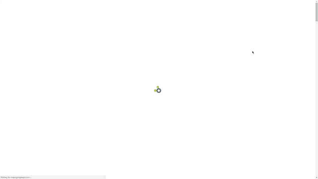

<p align="center">
  <a href="https://github.com/tbaltrushaitis/cv/releases"></a>
  <a href="https://github.com/tbaltrushaitis/cv/blob/master/LICENSE"></a>
  
</p>

<p align="center">
  <h1 align="center">CV, Resume and Portfolio website template</h1>
</p>

<p align="center">
  <a href="http://bit.ly/tomascv?ref=readme">
    
  </a>
</p>

<!-- # Best-in-Class modern CV, Resume and Portfolio # -->

:mortar_board: Best in Class modern CV, Resume and Portfolio website template.
All-in-One-Page site with simple and fully customizable builder.

`modern` `CV` `resume` `portfolio` `template` `live CV` `Career CV` `portfolio-website` `CV-template` `IT` `resume-template` `resume-website` `cv-website` `animated` `template-project`

---

## :computer: Live Demo ##
<!-- See it in action at :point_right: [Modern CV](http://bit.ly/tomascv?ref_domain=github.com&ref_section=docs&ref_file=readme) :point_left: -->
See how it look & feel at :point_right: [CV][CV] :point_left:

---

## :runner: Usage ##

### :one: Clone the repository ###
```shell
$ APP_NAME=cv \
&& git clone https://github.com/tbaltrushaitis/${APP_NAME}.git \
&& cd ${APP_NAME}
```

### :two: Install dependencies ###
```shell
$ make setup
```

### :three: Configure ###

Replace values in `config/person.json` with your personal information

### :four: Build ###
```shell
$ make build
```

### :five: Deploy ###
```shell
$ make deploy
```

This will create/update `webroot` directory inside the project root.
Use this directory as DocumentRoot in VirtualHost configuration of your web server.

### :white_check_mark: Enjoy  ###

Post a link to your CV on sites where you need your personal profile page should be discovered by other users and that provide a lots of information about your professional skills and experience.
For example: [Modern CV](http://bit.ly/tomascv)

---

## :label: Components ##

 Name | Version | Scope | Description |
:-----|:-------:|:-----:|:------------|
 [animate.css](http://daneden.github.io/animate.css/) | 4.1.0 | Front | A cross-browser library of CSS animations
 [FontAwesome](https://fontawesome.com/) | 5.13.0 | Front | The iconic Font and CSS toolkit
 [Bootstrap](http://getbootstrap.com) | 3.3.7 | Front | Front-end framework for developing responsive, mobile first projects on the web
 [jQuery](http://jquery.com/) | 3.5.1 | Front | JavaScript Library
 [noty](http://ned.im/noty) | 2.4.1 | Front | Notification library
 [waypoints](https://github.com/imakewebthings/waypoints) | 4.0.1 | Front | Easily execute a function when you scroll to an element
 [wow.js](https://wowjs.uk/) | 1.3.0 | Front | Reveal CSS animation as you scroll down a page
 [iamx](https://trendytheme.net/items/i-am-x-html-resume-template/) | 1.2.0 | Front | Trendy Theme

---

## :wrench: Dev Tools ##

 Name | Description |
:-----|:------------|
 [bower](http://bower.io) | A package manager for the web
 [gulp](http://gulpjs.com) | Toolkit for automating tasks in development workflow
 [gulp-token-replace](https://github.com/Pictela/gulp-token-replace) | Token replace plugin for Gulp
 [jimp](https://github.com/oliver-moran/jimp) | An image processing library written entirely in JavaScript for Node
 [terser](https://github.com/terser-js/terser) | A JavaScript parser and mangler/compressor toolkit for ES6+

---

## :pushpin: Todo List ##

- [ ] - upgrade to noty v3
- [ ] - upgrade to bootstrap v4
- [ ] - implement require.js configuration
- [ ] - upgrade gulp to v4

See [CHANGELOG][Changelog] for the history of changes and improvements.

---

Read [LICENSE][License] for copyright information

---

## FAQ ##

### What is a CV? ###
- CV stands for "**Curriculum Vitae**"
- Curriculum vitae is Latin for "**Life Story**"
- A CV is a formatted version of **one's master experience document**

### What to Include in a CV ###
A CV should at least include the following:
- Personal information
- Work experience
- Skills
- Education
- Personal profile and interests
- References

#### Personal Information ####
Personal information should include name, address, telephone, and email. I will suggest you put this information at the top of your CV and make it look like a letterhead.

#### Work Experience ####
List what you have done - most recent work experience first.
Include a short job description and your responsibilities.
Make sure your work experience is on the first page of your CV. This outlines your skills and selling points.

#### Skills ####
Skills are best described with a list.
List your skills - most important and relevant first.

#### Education ####
Education is best described with a list.
List what you have studied - most recent education first.
> Don't forget subject options, special project, courses, or diplomas.

#### References ####
List only a few names - like a teacher from your place of study, and a superior from a work situation - and make sure they can easily be reached and are willing to give you a good reference.

#### Personal Profile ####
Personal profile should include additional information about your age, status, interests and other relevant information that can produce a positive picture of your character. Put this in the last paragraph of your CV.

---

## What Is a Curriculum Vitae? ##

`Curriculum vitae` (CV) provides a summary of one’s experience and skills.

CVs include information on one’s academic background, including teaching experience, degrees, research, awards, publications, presentations, and other achievements. CVs are thus much longer than resumes, and include more information, particularly related to academic background.

A curriculum vitae summary is a one-to-two-page, condensed version of a full curriculum vitae. A CV summary is a way to quickly and concisely convey one’s skills and qualifications. Sometimes large organizations will ask for a `one-page CV` summary when they expect a large pool of applicants.

Full article about what is [Curriculum vitae](http://bit.ly/2QfaIBD)

---

### :link: More Info ###

 - [GitHub: Basic writing and formatting syntax](https://help.github.com/articles/basic-writing-and-formatting-syntax)
 - [BitBucket: markdown Howto](https://bitbucket.org/tutorials/markdowndemo)
 - [Linking containers](https://docs.docker.com/engine/userguide/networking/default_network/dockerlinks.md)
 - [Cross-host linking containers](https://docs.docker.com/engine/admin/ambassador_pattern_linking.md)
 - [Creating an Automated Build](https://docs.docker.com/docker-hub/builds/)

---
> Developed in **May 2016**

:scorpius:

[Changelog]: CHANGELOG.md
[License]: LICENSE.md
[CV]: http://bit.ly/tomascv?ref_domain=github.com&ref_section=docs&ref_file=readme
